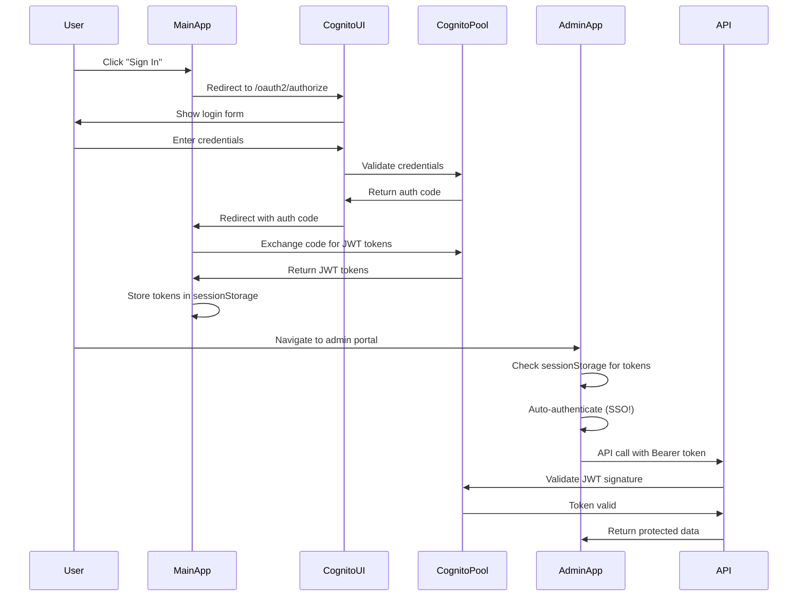

# Cognito SSO Multi-Application POC

This Proof of Concept (POC) demonstrates a complete AWS Cognito Single Sign-On (SSO) implementation across multiple applications with cross-subdomain authentication. The goal is to show how users can authenticate once and seamlessly access different applications in your ecosystem without re-authentication.

## 🎯 POC Objectives

This POC demonstrates the following real-world scenarios:

### **Enterprise Use Case**
- **Main App**: Employee portal for general company information and self-service
- **Admin Portal**: Management interface for administrators and HR personnel
- **API Backend**: Shared services that both applications consume with proper authentication

### **Technical Demonstrations**
- ✅ **Single Sign-On**: Authenticate once, access multiple applications
- ✅ **Cross-Subdomain Authentication**: Seamless token sharing across different domains
- ✅ **Role-Based Access Control**: Different permissions based on user roles
- ✅ **JWT Token Validation**: Secure API access with proper token verification
- ✅ **Production-Ready Architecture**: Scalable design suitable for real enterprises
- ✅ **External IDP Integration (Phase 2)**: Feature-flagged Auth0 SSO via Cognito federation
- ✅ **AWS Amplify Auth**: Amplify-based token management with legacy fallback support

## 🏗️ POC Architecture Overview

```
                    ┌─────────────────────────────────────────┐
                    │           AWS Cognito User Pool         │
                    │                                         │
                    │ 🔐 Centralized Authentication           │
                    │ 👥 User Management & Roles              │
                    │ 🎫 JWT Token Generation                 │
                    │ 🌐 OAuth 2.0 + OpenID Connect          │
                    └─────────────────┬───────────────────────┘
                                     │
                    📡 JWT Tokens shared via sessionStorage
                                     │
        ┌────────────────────────────┼────────────────────────────┐
        │                            │                            │
        │                            │                            │
   ┌────▼─────┐               ┌─────▼─────┐               ┌──────▼──────┐
   │ Main App │               │Admin Portal│               │ API Backend │
   │ (React)  │◄─────────────►│ (React)   │◄─────────────►│ (Node.js)   │
   │          │               │           │               │             │
   │ 🏠 Portal │               │ 🔧 Admin  │               │ 🚀 Services │
   │ 👤 Profile│               │ 📊 Stats  │               │ 🛡️ Auth     │
   │ 🌐 Public │               │ 👥 Users  │               │ 📡 CORS     │
   └──────────┘               │ 🔒 Secure │               │ ⚡ Fast     │
                              └───────────┘               └─────────────┘

   Port: 3000                 Port: 3001                  Port: 3001/api
   Users: All                 Users: Admins Only          Users: Authenticated
```

## 🔄 POC User Journey Flow

### **Scenario 1: New User Registration**
```
1. User visits Main App (localhost:3000)
2. Clicks "Sign In" → Redirected to Cognito Hosted UI
3. Creates new account with email verification
4. Redirected back to Main App with JWT tokens
5. User sees personalized dashboard
6. User navigates to Admin Portal → Access Denied (not admin)
```

### **Scenario 2: Admin User Experience**  
```
1. Admin visits Main App and signs in
2. Sets custom:role = "admin" in Cognito (for demo)
3. Navigates to Admin Portal → Auto-authenticated (SSO!)
4. Sees system metrics, user management, logs
5. Makes API calls that require admin privileges
6. Can switch between apps seamlessly
```

### **Scenario 3: API Integration**
```
1. Any authenticated user can call basic API endpoints
2. Admin users can access admin-specific endpoints
3. JWT tokens automatically included in requests
4. API validates tokens against Cognito JWKS
5. Role-based responses based on user permissions
```

## � App Interconnections in This POC

### **How the Apps Work Together**

```
🔄 SSO TOKEN FLOW:
   User signs in → Cognito issues JWT → Stored in sessionStorage → Shared across all apps

📱 MAIN APP (Employee Portal)
   ├── 🎯 Purpose: Primary authentication entry point
   ├── 👤 Audience: All employees  
   ├── 🔑 Features: Profile, dashboard, app navigation
   └── 🌐 Integration: Links to Admin Portal, calls API

🔧 ADMIN PORTAL (Management Dashboard)
   ├── 🎯 Purpose: Administrative interface
   ├── 👤 Audience: Administrators only (role-based)
   ├── 🔑 Features: User management, system stats, logs
   └── 🌐 Integration: Reads tokens from Main App, calls Admin API

🚀 API BACKEND (Shared Services)
   ├── 🎯 Purpose: Centralized data and business logic
   ├── 👤 Audience: Both apps (different endpoints per role)
   ├── 🔑 Features: JWT validation, role-based access, CORS
   └── 🌐 Integration: Validates tokens from both apps
```

### **Business Value Demonstrated**

| Business Need | POC Solution | Real-World Application |
|---------------|--------------|------------------------|
| **Reduce Login Friction** | Single sign-on across apps | Employees access HR, Finance, IT portals seamlessly |
| **Role-Based Security** | Admin vs User permissions | Different access levels for different job functions |
| **Centralized User Management** | One Cognito User Pool | IT manages all users from single location |
| **Scalable Architecture** | Microservices with JWT | Add new apps without changing authentication |
| **Cost Effective** | Serverless deployment | Pay only for what you use, scales automatically |

## 📁 Project Structure

```
react-apps-example/
├── main-app/                   # 🏠 MAIN APPLICATION
│   ├── src/
│   │   ├── components/         # Dashboard, Navigation, AuthSelection
│   │   ├── hooks/             # useSubdomainAuth (legacy, preserved for reference)
│   │   ├── utils/             # tokenManager (Amplify instance + legacy static)
│   │   ├── config.js          # Cognito, feature flags & app URLs
│   │   └── App.js             # Auth flow — AWS Amplify + AuthSelection
│   ├── package.json           # React + aws-amplify dependencies
│   └── amplify.yml            # AWS Amplify deployment
│
├── admin-portal/              # 🔧 ADMIN APPLICATION
│   ├── src/
│   │   ├── components/        # AdminDashboard, Navigation, AuthSelection
│   │   ├── utils/            # tokenManager (Amplify instance + legacy static)
│   │   ├── config.js         # Same Cognito, admin-specific config & feature flags
│   │   └── App.js            # Role validation — tokenManagerInstance + legacy fallback
│   ├── package.json          # React + aws-amplify dependencies
│   └── amplify.yml           # Separate Amplify deployment
│
├── api-backend/              # 🚀 SHARED API SERVICES
│   ├── middleware/           # JWT validation middleware
│   ├── routes/              # Role-based API endpoints
│   │   ├── public.js        # Health, docs (no auth)
│   │   ├── protected.js     # Profile, activity (auth required)
│   │   └── admin.js         # Stats, users (admin role required)
│   ├── server.js            # Express + CORS + security
│   ├── lambda.js            # AWS Lambda wrapper
│   ├── package.json         # Express + JWT + security
│   ├── Dockerfile           # Container deployment option
│   └── serverless.yml       # Lambda deployment option
│
└── README.md                # This comprehensive guide
```

## 🚀 Quick Start

### Prerequisites

- Node.js 16+ installed
- AWS Account with access to Cognito and Amplify
- Git installed
- Basic understanding of React and Node.js

### 1. Clone and Setup

```bash
# Clone the repository
git clone <your-repo-url>
cd cognito-sso/react-apps-example

# Install dependencies for all applications
cd main-app && npm install
cd ../admin-portal && npm install
cd ../api-backend && npm install
```

### 2. Configure AWS Cognito User Pool

#### Create User Pool

1. **Go to AWS Cognito Console**
   - Navigate to: AWS Console → Cognito → User Pools → Create user pool

2. **Configure Sign-in Experience**
   ```
   Authentication providers: ✓ Cognito user pool
   Sign-in options: ✓ Email
   ```

3. **Configure Security Requirements**
   ```
   Password policy: Use defaults (8 chars, mixed case, numbers, symbols)
   Multi-factor authentication: No MFA (for demo)
   User account recovery: Email only
   ```

4. **Configure Sign-up Experience**
   ```
   ✓ Enable self-service sign-up
   Required attributes: email, name
   Optional custom attributes: role (String, mutable)
   ```

5. **Integrate Your App**
   ```
   User pool name: cognito-sso-demo
   Initial app client: main-web-app
   Client type: Public client
   ✗ Generate a client secret (UNCHECK this)
   ```

6. **Configure Hosted UI**
   ```
   Domain prefix: cognito-sso-demo-[random]
   Callback URLs: http://localhost:3000/, http://localhost:3001/
   Sign-out URLs: http://localhost:3000/, http://localhost:3001/
   OAuth grant types: ✓ Authorization code grant
   OAuth scopes: ✓ openid ✓ email ✓ profile
   ```

#### Note Important Values

After creation, save these values:
```
User Pool ID: us-east-1_XXXXXXXXX
App Client ID: abcd1234567890
Cognito Domain: cognito-sso-demo-xyz.auth.us-east-1.amazoncognito.com
Region: us-east-1
```

### 3. Configure Applications

#### Main App Configuration

Create `main-app/.env.local`:
```env
REACT_APP_COGNITO_AUTHORITY=https://cognito-idp.us-east-1.amazonaws.com/us-east-1_XXXXXXXXX
REACT_APP_COGNITO_CLIENT_ID=your-client-id-here
REACT_APP_COGNITO_DOMAIN=https://cognito-sso-demo-xyz.auth.us-east-1.amazoncognito.com
REACT_APP_API_BASE_URL=http://localhost:3001/api
REACT_APP_MAIN_APP_URL=http://localhost:3000
REACT_APP_ADMIN_APP_URL=http://localhost:3001

# Feature Flags (Phase 2)
REACT_APP_USE_EXTERNAL_IDP=false
REACT_APP_ENABLE_MFA=false
REACT_APP_ENABLE_SOCIAL_LOGIN=false
```

#### Admin Portal Configuration

Create `admin-portal/.env.local`:
```env
REACT_APP_COGNITO_AUTHORITY=https://cognito-idp.us-east-1.amazonaws.com/us-east-1_XXXXXXXXX
REACT_APP_COGNITO_CLIENT_ID=your-client-id-here
REACT_APP_COGNITO_DOMAIN=https://cognito-sso-demo-xyz.auth.us-east-1.amazoncognito.com
REACT_APP_API_BASE_URL=http://localhost:3001/api
REACT_APP_MAIN_APP_URL=http://localhost:3000
REACT_APP_ADMIN_APP_URL=http://localhost:3001

# Feature Flags (Phase 2 — keep in sync with main app)
REACT_APP_USE_EXTERNAL_IDP=false
REACT_APP_ENABLE_MFA=false
REACT_APP_ENABLE_SOCIAL_LOGIN=false
```

#### API Backend Configuration

Create `api-backend/.env`:
```env
NODE_ENV=development
PORT=3001
COGNITO_USER_POOL_ID=us-east-1_XXXXXXXXX
COGNITO_REGION=us-east-1
COGNITO_APP_CLIENT_ID=your-client-id-here
ALLOWED_ORIGINS=http://localhost:3000,http://localhost:3001
```

### 4. Run the Applications

#### Terminal 1 - Main App
```bash
cd main-app
npm start
# Runs on http://localhost:3000
```

#### Terminal 2 - Admin Portal
```bash
cd admin-portal
BROWSER=none PORT=3001 npm start
# Runs on http://localhost:3001
```

#### Terminal 3 - API Backend
```bash
cd api-backend
npm run dev
# Runs on http://localhost:3001
```

### 5. Test the POC Scenarios

#### **Scenario A: Regular User Experience**
1. **Visit Main App**: http://localhost:3000
2. **Sign Up/In**: Click "Sign In with Cognito" → Complete registration
3. **Explore Dashboard**: See profile info, test API calls
4. **Try Admin Portal**: Visit http://localhost:3001 → Should see "Access Denied"
5. **Back to Main**: Seamless navigation, still authenticated

#### **Scenario B: Admin User Experience** 
1. **Set Admin Role**: In Cognito Console → Users → Your user → Edit attributes → Add `custom:role = admin`
2. **Visit Main App**: http://localhost:3000 → Sign in if needed
3. **Access Admin Portal**: Navigate to http://localhost:3001 → **Auto-authenticated! (SSO Magic!)** ✨
4. **Explore Admin Features**: View system stats, user management, logs
5. **Test API Calls**: Admin endpoints should work with elevated permissions

#### **Scenario C: API Integration Testing**
6. **Use Browser DevTools**: See JWT tokens in sessionStorage
7. **Test API Directly**: Copy token and test with curl/Postman
8. **Role-Based Responses**: Different data based on user role

## 🔐 Authentication Flow

### OAuth 2.0 Authorization Code Grant + OpenID Connect



## 🌐 Deployment to AWS Amplify

### Deploy Main App

1. **Create Amplify App**
   ```
   AWS Console → Amplify → Host web app
   → Connect GitHub repository
   → Select main-app folder
   ```

2. **Configure Build Settings**
   - Amplify will auto-detect React and create `amplify.yml`
   - The file is already included in the project

3. **Set Environment Variables**
   ```
   App Settings → Environment variables:
   REACT_APP_COGNITO_AUTHORITY=https://cognito-idp.us-east-1.amazonaws.com/us-east-1_XXXXXXXXX
   REACT_APP_COGNITO_CLIENT_ID=your-client-id-here
   REACT_APP_COGNITO_DOMAIN=https://your-domain.auth.us-east-1.amazoncognito.com
   ```

4. **Update Cognito Callback URLs**
   - Add your Amplify URL to callback URLs in Cognito console
   - Example: `https://main.d1234567890.amplifyapp.com/`

### Deploy Admin Portal

Repeat the same process for the admin portal, creating a separate Amplify app.

### Deploy API Backend

#### Option 1: AWS Lambda (Recommended)
```bash
cd api-backend
npm install -g serverless
npm install serverless-http serverless-offline
serverless deploy
```

#### Option 2: AWS App Runner or ECS
Use the included `Dockerfile` for containerized deployment.

## 📚 API Documentation

### Public Endpoints

- `GET /api/health` - Health check
- `GET /api/info` - API information
- `GET /api/docs` - Full API documentation

### Protected Endpoints (Requires Authentication)

- `GET /api/protected/profile` - Get user profile
- `GET /api/protected/test` - Test authentication
- `PUT /api/protected/profile` - Update profile

### Admin Endpoints (Requires Admin Role)

- `GET /api/admin/stats` - System statistics
- `GET /api/admin/users` - List all users
- `GET /api/admin/logs` - System logs

### Authentication

All protected endpoints require a JWT token in the Authorization header:
```
Authorization: Bearer <your-jwt-token>
```

## 👥 User Roles

### Regular User
- Can access main app
- Can view/update own profile
- Cannot access admin portal

### Admin User
- Can access all applications
- Can view system statistics
- Can manage other users
- Can view system logs

### Setting User Roles

To test admin functionality, you need to set the `custom:role` attribute:

1. **Via AWS Console**:
   ```
   Cognito → User pools → Users → Select user → Edit attributes
   Add custom:role = admin
   ```

2. **Via API** (if you implement user management):
   ```javascript
   // In your user management code
   await cognitoIdentityProvider.adminUpdateUserAttributes({
     UserPoolId: 'us-east-1_XXXXXXXXX',
     Username: 'user@example.com',
     UserAttributes: [
       {
         Name: 'custom:role',
         Value: 'admin'
       }
     ]
   }).promise();
   ```

## 🔧 Configuration Options

### Environment Variables

#### React Apps
- `REACT_APP_COGNITO_AUTHORITY` - Cognito User Pool authority URL
- `REACT_APP_COGNITO_CLIENT_ID` - App client ID
- `REACT_APP_COGNITO_DOMAIN` - Cognito domain for hosted UI
- `REACT_APP_API_BASE_URL` - API backend URL
- `REACT_APP_MAIN_APP_URL` - Main app URL
- `REACT_APP_ADMIN_APP_URL` - Admin app URL
- `REACT_APP_USE_EXTERNAL_IDP` - `true` to enable Auth0 SSO option (Phase 2, default: `false`)
- `REACT_APP_ENABLE_MFA` - `true` to enable MFA flow (Phase 2, default: `false`)
- `REACT_APP_ENABLE_SOCIAL_LOGIN` - `true` to enable social login (Phase 2, default: `false`)

#### API Backend
- `COGNITO_USER_POOL_ID` - User Pool ID
- `COGNITO_REGION` - AWS region
- `COGNITO_APP_CLIENT_ID` - App client ID for token validation
- `ALLOWED_ORIGINS` - CORS allowed origins
- `PORT` - Server port (default: 3001)

### Security Settings

The project includes several security features:
- **Rate limiting**: 100 requests per 15 minutes per IP
- **CORS protection**: Only allowed origins can make requests
- **Helmet.js**: Security headers
- **JWT validation**: Proper token signature verification
- **Role-based access**: Admin endpoints require admin role

## 🐛 Troubleshooting

### Common Issues

#### 1. CORS Errors
```
Error: Access to fetch at 'API_URL' blocked by CORS policy
```
**Solution**: Ensure API backend `ALLOWED_ORIGINS` includes your frontend URLs.

#### 2. Token Validation Fails
```
Error: Invalid token issuer
```
**Solution**: Verify `COGNITO_USER_POOL_ID` and `COGNITO_REGION` in API backend.

#### 3. Redirect Loop
```
User gets stuck in authentication redirect
```
**Solution**: Check callback URLs in Cognito match your app URLs exactly.

#### 4. Admin Access Denied
```
User can't access admin portal
```
**Solution**: Set `custom:role` attribute to `admin` in Cognito console.

### Debug Mode

Enable debug logging by setting:
```env
LOG_LEVEL=debug
NODE_ENV=development
```

### Testing Authentication

Use the built-in test endpoints:
```bash
# Test public endpoint
curl http://localhost:3001/api/health

# Test protected endpoint (requires token)
curl -H "Authorization: Bearer YOUR_TOKEN" http://localhost:3001/api/protected/test

# Test admin endpoint (requires admin role)
curl -H "Authorization: Bearer ADMIN_TOKEN" http://localhost:3001/api/admin/stats
```

## 🎯 Features Demonstrated

### ✅ Implemented Features

- [x] **Native Cognito Authentication** - OAuth 2.0 + OpenID Connect via AWS Amplify
- [x] **Cross-Subdomain SSO** - Token sharing via Amplify session + legacy sessionStorage fallback
- [x] **Role-Based Access Control** - Admin vs regular user permissions
- [x] **JWT Token Validation** - Secure API authentication
- [x] **Responsive UI** - Mobile-friendly design
- [x] **Auto-redirect** - Seamless cross-app navigation
- [x] **Admin Dashboard** - System metrics and user management
- [x] **API Documentation** - Interactive endpoint documentation
- [x] **Error Handling** - Comprehensive error management
- [x] **Security Headers** - CORS, rate limiting, helmet.js
- [x] **Production Ready** - Amplify deployment configuration
- [x] **AuthSelection Component** - UI for selecting between native Cognito and External IDP (Phase 2)
- [x] **External IDP Feature Flag** - `REACT_APP_USE_EXTERNAL_IDP` gates Auth0 SSO option (Phase 2)
- [x] **AWS Amplify Auth Integration** - `tokenManagerInstance` wraps Amplify Auth for both sign-in methods

### 🚀 Production Considerations

For production deployment, consider:

1. **Custom Domain**: Set up custom domain for Cognito
2. **SSL/TLS**: Ensure all endpoints use HTTPS
3. **Database**: Replace mock data with real database
4. **Monitoring**: Add CloudWatch logs and metrics
5. **Backup**: Implement data backup strategies
6. **Scaling**: Configure auto-scaling for API
7. **CDN**: Use CloudFront for static assets
8. **Security**: Enable AWS WAF, implement IP whitelisting

## 📖 Additional Resources

- [AWS Cognito Documentation](https://docs.aws.amazon.com/cognito/)
- [AWS Amplify Hosting](https://docs.aws.amazon.com/amplify/)
- [AWS Amplify Auth (aws-amplify)](https://docs.amplify.aws/lib/auth/getting-started/q/platform/js/)
- [OpenID Connect Specification](https://openid.net/connect/)
- [JWT Token Validation](https://jwt.io/)
- [Auth0 Cognito Federation Guide](https://auth0.com/docs/authenticate/identity-providers/enterprise-identity-providers/saml-identity-provider/aws-cognito)

## 🤝 Contributing

1. Fork the repository
2. Create a feature branch
3. Make your changes
4. Test thoroughly
5. Submit a pull request

## 📄 License

This project is licensed under the MIT License - see the [LICENSE](LICENSE) file for details.

## 🙋‍♂️ Support

If you need help:
1. Check the troubleshooting section
2. Review AWS Cognito logs
3. Check browser developer tools
4. Verify environment variables
5. Test with curl commands

---

**🎉 Congratulations!** You now have a complete Cognito SSO implementation with cross-subdomain authentication, role-based access control, and production-ready deployment configuration.